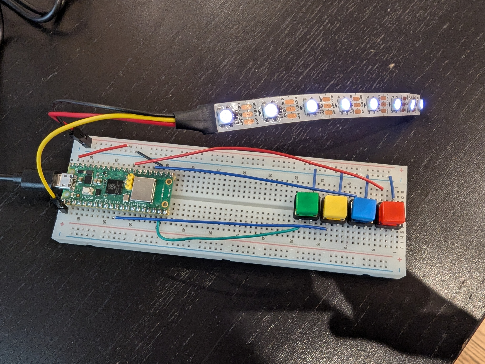

# Simon Says

An exploration in getting a playable game of Simon Says using the Raspberry Pi
Pico, a Neopixel strip, and some buttons.

Game play: display a pattern on the LED strip briefly and expect user to copy it
by mashing the colored buttons in order.

## Wiring

Details:
- 4 Pull Up Resitor Buttons: One leg is attached to ground, one is attached to a GPIO Pin on the device
- Neopixel strip: Attached to ground, GPIO Pin 0, and the VBUS Pin (5 V)

Earlier explorations included a potentiometer to control the speed of the game,
but that can come for a later iteration.
